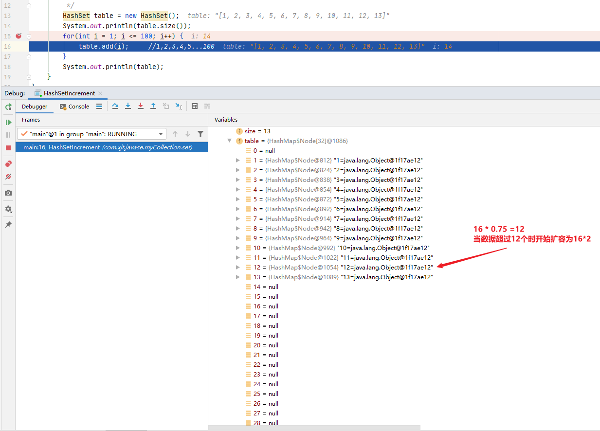
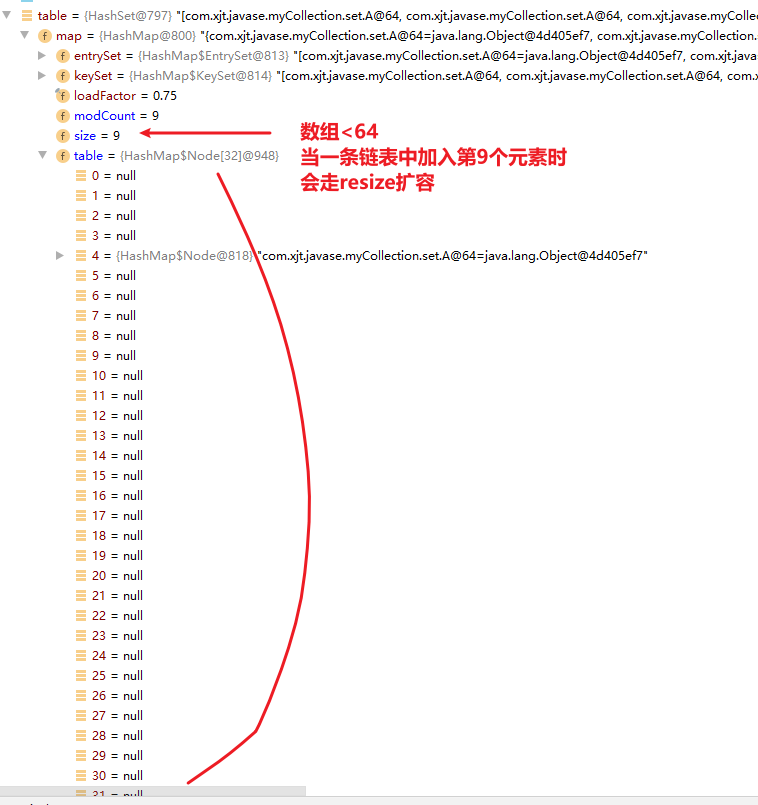

# Set深入研究

> 官方解释：不包含重复元素的集合。 更正式地说，集合不包含元素对`e1`和`e2`  ，使得`e1.equals(e2)`和最多一个null元素。  正如其名称所暗示的，此接口模拟数学集抽象。 

Set 也叫做集合，跟数学中的集合一样，set不允许有重复值

## Set接口基本用法

### Set接口继承和实现

所有已知实现类： 

`AbstractSet` 

 `ConcurrentHashMap.KeySetView`  

 `ConcurrentSkipListSet` 

 `CopyOnWriteArraySet` 

 `EnumSet` 

 `HashSet` 	:star::star::star:

 `JobStateReasons`  

 `LinkedHashSet` 	:star::star::star:

`TreeSet` 	:star::star::star:


### 方法

和List接口一样，Set接口也是Collection的子接口，因此Set接口也拥有Collection的方法


```java
public class SetDemo1 {
    public static void main(String[] args) {
        //你真的了解add方法吗？
        Set hashSet = new HashSet();
        hashSet.add("jack");
        hashSet.add("lucy");
        hashSet.add("justin");
        hashSet.add(null);
        hashSet.add(null);
        hashSet.add("jack");
        System.out.println(hashSet);        //[null, justin, lucy, jack]

        hashSet = new HashSet();

        System.out.println(hashSet);        // []

        hashSet.add("alex");
        hashSet.add("jack");
        hashSet.add("lucy");
        hashSet.add(new Dog("tom"));
        hashSet.add(new Dog("tom"));
        hashSet.add(new String("david"));
        hashSet.add(new String("david"));
        System.out.println(hashSet);    //  [alex, david, Dog{name='tom'}, lucy, jack, Dog{name='tom'}]
    }
}

class Dog{
    private String name;

    public Dog(String name) {
        this.name = name;
    }

    @Override
    public String toString() {
        return "Dog{" +
                "name='" + name + '\'' +
                '}';
    }
}
```


### 遍历

同Collection的遍历方式一样，因为Set接口是Collection接口的子接口。

1.可以使用迭代器；

2.增强for；

3.不能使用索引的方式来获取；

**注意：**

> Set接口对象（即Set接口的实现类对象）可以存null值，且只能存一个null，取出的顺序不是按照add 存入的顺序，取出的顺序是有一套算法的 是固定的（在源码部分进行详细分析），第一次和第n次的取出顺序是一样的（不会出现第一次和第二次 第三次的取出顺序不同）

## HashMap源码分析

### 模拟HashMap底层结构

HashSet底层其实是HashMap，jdk8版本之后 HashMap的底层是 `数组 + 链表 + 红黑树`，jdk8之前是 HashMap的底层数据结构是 `数组 + 链表`

```java
package java.util;

import java.io.InvalidObjectException;
import jdk.internal.access.SharedSecrets;

public class HashSet<E>
    extends AbstractSet<E>
    implements Set<E>, Cloneable, java.io.Serializable
{
    @java.io.Serial
    static final long serialVersionUID = -5024744406713321676L;

    private transient HashMap<E,Object> map;

    // Dummy value to associate with an Object in the backing Map
    private static final Object PRESENT = new Object();

    /**
     * Constructs a new, empty set; the backing {@code HashMap} instance has
     * default initial capacity (16) and load factor (0.75).
     */
    public HashSet() {
        map = new HashMap<>();
    }

    /**
     * Constructs a new set containing the elements in the specified
     * collection.  The {@code HashMap} is created with default load factor
     * (0.75) and an initial capacity sufficient to contain the elements in
     * the specified collection.
     *
     * @param c the collection whose elements are to be placed into this set
     * @throws NullPointerException if the specified collection is null
     */
    public HashSet(Collection<? extends E> c) {
        map = new HashMap<>(Math.max((int) (c.size()/.75f) + 1, 16));
        addAll(c);
    }

    /**
     * Constructs a new, empty set; the backing {@code HashMap} instance has
     * the specified initial capacity and the specified load factor.
     *
     * @param      initialCapacity   the initial capacity of the hash map
     * @param      loadFactor        the load factor of the hash map
     * @throws     IllegalArgumentException if the initial capacity is less
     *             than zero, or if the load factor is nonpositive
     */
    public HashSet(int initialCapacity, float loadFactor) {
        map = new HashMap<>(initialCapacity, loadFactor);
    }

    /**
     * Constructs a new, empty set; the backing {@code HashMap} instance has
     * the specified initial capacity and default load factor (0.75).
     *
     * @param      initialCapacity   the initial capacity of the hash table
     * @throws     IllegalArgumentException if the initial capacity is less
     *             than zero
     */
    public HashSet(int initialCapacity) {
        map = new HashMap<>(initialCapacity);
    }

    /**
     * Constructs a new, empty linked hash set.  (This package private
     * constructor is only used by LinkedHashSet.) The backing
     * HashMap instance is a LinkedHashMap with the specified initial
     * capacity and the specified load factor.
     *
     * @param      initialCapacity   the initial capacity of the hash map
     * @param      loadFactor        the load factor of the hash map
     * @param      dummy             ignored (distinguishes this
     *             constructor from other int, float constructor.)
     * @throws     IllegalArgumentException if the initial capacity is less
     *             than zero, or if the load factor is nonpositive
     */
    HashSet(int initialCapacity, float loadFactor, boolean dummy) {
        map = new LinkedHashMap<>(initialCapacity, loadFactor);
    }

    public Iterator<E> iterator() {
        return map.keySet().iterator();
    }

    ...
}
```

> 从上述 HashSet 源码 可以看到，new HashSet()  对象 底层其实是 new 一个HashMap对象

这里我们用 `数组+链表` 来模拟一下HashMap

```java
/**
 * 模拟HashMap底层 数据结构
 */
public class HashSetStructureDemo {
    public static void main(String[] args) {
        //1.创建一个数组 存放Node 也就是表
        Node[] table = new Node[16];

        //创建节点
        Node john = new Node("John", null);
        Node Jack = new Node("Jack", null);
        Node Lucy = new Node("Lucy", null);
        Node Tom = new Node("Tom", null);
        Node Jerry = new Node("Jerry", null);
        Node Mary = new Node("Mary", null);
        table[0] = john;
        john.next = Jack;
        Jack.next = Lucy;
        table[3] = Tom;
        Tom.next = Jerry;
        table[5] = Mary;

        System.out.println(table);
    }
}

class Node{
    public Object item; //存放元素
    public Node next;   //指向下一个节点

    public Node(Object item, Node next) {
        this.item = item;
        this.next = next;
    }

    @Override
    public String toString() {
        return "Node{" +
                "item=" + item +
                ", next=" + next +
                '}';
    }
}
```


### add(E e) 添加元素源码分析

```java
public class HashSetSource {
    public static void main(String[] args) {
        HashSet hashSet = new HashSet();
        hashSet.add("java");    //到此位置，第 1 次 add 分析完毕.
        hashSet.add("php");     //到此位置，第 2 次 add 分析完毕
        hashSet.add("java");

        System.out.println("set=" + hashSet);
    }
}
```

对该部分add方法断点调试分析：

```java
//private static final Object PRESENT = new Object();

//1. 执行 HashSet()
public HashSet() {
    map = new HashMap<>();
}
//2. 执行 add()
public boolean add(E e) {   //e = "java"
    return map.put(e, PRESENT)==null;
}

//3.执行 put() , 该方法会执行 hash(key) 得到 key 对应的 hash 值 算法 h = key.hashCode()) ^ (h >>> 16)
final V putVal(int hash, K key, V value, boolean onlyIfAbsent,
               boolean evict) {
    //定义辅助变量Node数组tab，辅助Node节点p ，table 就是 HashMap 的一个数组，类型是 Node[]
    HashMap.Node<K,V>[] tab; HashMap.Node<K,V> p; int n, i;
    
    //if 语句表示如果当前 table 是 null, 或者 大小=0
    //初始时 table是空的  第一次执行add方法 -> resize() 扩容
    if ((tab = table) == null || (n = tab.length) == 0)
        n = (tab = resize()).length;

    //(1)根据 key，得到 hash 去计算该 key 应该存放到 table 表的哪个索引位置，并把这个位置的对象，赋给 p
    //(2)判断 p 是否为 null
    //(2.1) 如果 p 为 null, 表示还没有存放元素, 就创建一个 Node (key="java",value=PRESENT)
    //放在该位置 tab[i] = newNode(hash, key, value, null)
    if ((p = tab[i = (n - 1) & hash]) == null)
        tab[i] = newNode(hash, key, value, null);
    else {
        //(2.1) tab[i] 位置有元素
        //一个开发技巧提示：在需要局部变量(辅助变量)时候，再创建
        HashMap.Node<K,V> e; K k;

        //如果当前索引位置对应的链表的第一个元素和准备添加的 key 的 hash 值一样
        //并且满足 下面两个条件之一:
        //(1) 准备加入的 key 和 p 指向的 Node 结点的 key 是同一个对象
        //(2) p 指向的 Node 结点的 key 的 equals() 和准备加入的 key 比较后相同，就不能加入
        if (p.hash == hash &&
            ((k = p.key) == key || (key != null && key.equals(k))))
            e = p;

        //再判断 p 是不是一颗红黑树,如果是一颗红黑树，就调用 putTreeVal，来进行添加
        else if (p instanceof HashMap.TreeNode)
            e = ((HashMap.TreeNode<K,V>)p).putTreeVal(this, tab, hash, key, value);
        
        else {
            //如果 table 对应索引位置，已经是一个链表, 就使用 for 循环比较
            //(1) 依次和该链表的每一个元素比较后，都不相同, 则加入到该链表的最后
            //注意：在把元素添加到链表后，立即判断 该链表是否已经达到 8 个结点, 就调用 treeifyBin() 对当前这个链表进行树化(转成红黑树)
            //注意，在转成红黑树时，要进行判断, 判断条件
            //if (tab == null || (n = tab.length) < MIN_TREEIFY_CAPACITY(64))
            //resize();
            //如果上面条件成立，先 table 扩容.
            //只有上面条件不成立时，才进行转成红黑树
            //(2) 依次和该链表的每一个元素比较过程中，如果有相同情况,就直接 break
            for (int binCount = 0; ; ++binCount) {
                if ((e = p.next) == null) {
                    p.next = newNode(hash, key, value, null);
                    if (binCount >= TREEIFY_THRESHOLD - 1) // -1 for 1st
                        treeifyBin(tab, hash);
                    break;
                }
                if (e.hash == hash &&
                    ((k = e.key) == key || (key != null && key.equals(k))))
                    break;
                p = e;
            }
        }
        if (e != null) { // existing mapping for key
            V oldValue = e.value;
            if (!onlyIfAbsent || oldValue == null)
                e.value = value;
            afterNodeAccess(e);
            return oldValue;
        }
    }
    ++modCount;
    //size 就是我们每加入一个结点 Node(k,v,h,next), size++
    if (++size > threshold)
        resize();       //扩容
    afterNodeInsertion(evict);
    return null;
}

```


> 说明
>
> 1、HashSet底层是HashMap
>
> 2、添加一个元素时，先得到hash值会转成->索引值
>
> 3、找到存储数据表table,看这个索引位置是否已经存放的有元素
>
> 4、如果没有，直接加入
>
> 5、如果有，调用equals比较，如果相同，就放弃添加，如果不相同，则添加到最后
>
> 6、在ava8中，如果一条链表的元素个数到达TREEIFY THRESHOLD(默认是8)，并且table的大小>=MIN TREEIFY CAPACITY(默认64)，就会进行树化（红黑树）

### resize() 扩容方法源码分析

```java
final Node<K,V>[] resize() {
    Node<K,V>[] oldTab = table;
    //初始时容量是0
    int oldCap = (oldTab == null) ? 0 : oldTab.length;
    //阈值threshold 初始为0
    int oldThr = threshold;
    int newCap, newThr = 0;
    if (oldCap > 0) {
        if (oldCap >= MAXIMUM_CAPACITY) {
            threshold = Integer.MAX_VALUE;
            return oldTab;
        }
        else if ((newCap = oldCap << 1) < MAXIMUM_CAPACITY &&
                 oldCap >= DEFAULT_INITIAL_CAPACITY)
            newThr = oldThr << 1; // double threshold
    }
    else if (oldThr > 0) // initial capacity was placed in threshold
        newCap = oldThr;
    else {               // 初始时进入这里，将默认容量16 默认阈值16*0.75 赋值给新的容量
        newCap = DEFAULT_INITIAL_CAPACITY;
        newThr = (int)(DEFAULT_LOAD_FACTOR * DEFAULT_INITIAL_CAPACITY);
    }
    if (newThr == 0) {
        float ft = (float)newCap * loadFactor;
        newThr = (newCap < MAXIMUM_CAPACITY && ft < (float)MAXIMUM_CAPACITY ?
                  (int)ft : Integer.MAX_VALUE);
    }
    threshold = newThr;
    @SuppressWarnings({"rawtypes","unchecked"})
    Node<K,V>[] newTab = (Node<K,V>[])new Node[newCap];
    table = newTab;
    if (oldTab != null) {
        for (int j = 0; j < oldCap; ++j) {
            Node<K,V> e;
            if ((e = oldTab[j]) != null) {
                oldTab[j] = null;
                if (e.next == null)
                    newTab[e.hash & (newCap - 1)] = e;
                else if (e instanceof TreeNode)
                    ((TreeNode<K,V>)e).split(this, newTab, j, oldCap);
                else { // preserve order
                    Node<K,V> loHead = null, loTail = null;
                    Node<K,V> hiHead = null, hiTail = null;
                    Node<K,V> next;
                    do {
                        next = e.next;
                        if ((e.hash & oldCap) == 0) {
                            if (loTail == null)
                                loHead = e;
                            else
                                loTail.next = e;
                            loTail = e;
                        }
                        else {
                            if (hiTail == null)
                                hiHead = e;
                            else
                                hiTail.next = e;
                            hiTail = e;
                        }
                    } while ((e = next) != null);
                    if (loTail != null) {
                        loTail.next = null;
                        newTab[j] = loHead;
                    }
                    if (hiTail != null) {
                        hiTail.next = null;
                        newTab[j + oldCap] = hiHead;
                    }
                }
            }
        }
    }
    return newTab;
}
```

### 扩容Demo演示

```java
/*
        HashSet 底层是 HashMap, 第一次添加时，table 数组扩容到 16，
        临界值(threshold)是 16*加载因子(loadFactor)是 0.75 = 12
        如果 table 数组使用到了临界值 12,就会扩容到 16 * 2 = 32,
        新的临界值就是 32*0.75 = 24, 依次类推
         */
HashSet table = new HashSet();
System.out.println(table.size());
for(int i = 1; i <= 100; i++) {
    table.add(i);     //此处打断点
}
System.out.println(table);
```




### `链表长度>8` 时扩容Demo演示

```java
public class HashSetIncrement {
    public static void main(String[] args) {
        /*在 Java8 中, 如果一条链表的元素个数到达 TREEIFY_THRESHOLD(默认是 8 )，
        并且 table 的大小 >= MIN_TREEIFY_CAPACITY(默认 64),就会进行树化(红黑树),
                否则仍然采用数组扩容机制*/

        for (int i = 0; i < 12; i++) {
            table.add(new A(i));	//此处打断点
        }

    }
}

class A{
    public int n;

    public A(int n) {
        this.n = n;
    }

    @Override
    public int hashCode() {
        return 100;
    }
}
```




### `链表长度>8 + 数组>64` 时树化Demo演示

```java
HashSet table = new HashSet();
for (int i = 0; i < 100; i++) {
    table.add(new A(i));
    if(i>65){
        System.out.println(table);		//此处打断点
    }
}
```


## LinkedHashSet源码分析

### LinkedHashSet说明

- 从继承关系图上看，LinkedHashSet 是 HashSet 的子类；

- LinkedHashSet 底层是一个 LinkedHashMap，底层维护了一个 `数组+双向链表`；
- LinkedHashSet 根据元素的 hashCode 值来决定元素的存储位置，同时使用双向链表维护元素的次序，这使得元素开起来是以插入顺序保存的；
- LinkedHashSet 同样也是Set集合，不允许添加重复元素；

### LinkedHashSet 底层机制

数组+双向链表 添加元素的示意图：


说明：

1、在LinkedHastSet中维护了一个hash表和双向链表(LinkedHashSet有head和tail)

2、每一个节点有before和after属性，这样可以形成双向链表

3、在添加一个元素时，先求hash值，在求索引.，确定该元素在tablel的位置，然后将添加的元素加入到双向链表（如果已经存在，不添加（原则和 hashset 一样）

```java
tail.next = newElement;		//示意代码
newElement.pre  = tail;
tail = newEelment;
```

4、这样的话，我们遍历LinkedHashSet也能确保插入顺序和遍历顺序一致

### 源码分析与演示

```java
public class LinkedHashSetDemo {
    public static void main(String[] args) {
        Set<Object> set = new LinkedHashSet<>();
        set.add(new String("ABC"));
        set.add(123);
        set.add(123);
        set.add(new Cat("tom",3));
        set.add(456);
        set.add("java");
        System.out.println(set);
    }
}

@Data
@AllArgsConstructor
@NoArgsConstructor
class Cat{
    public String name;
    public int age;
}
```

